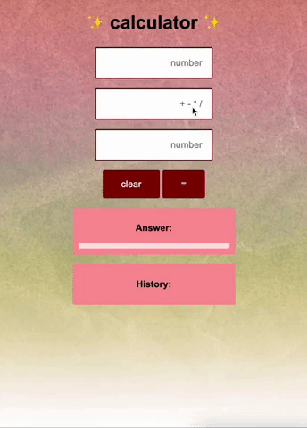

# CALCULATOR

## Description

_Duration: 7 hours_

This was one of the first applications I made, 8 weeks into learning how to code and only three days into learning how to store data locally.

I was asked to create a calculator that stores previous calulations on a server, and displays calculations to the webpage.

## Demo

 
To see the fully functional site, click [here]. (https://warm-castle-52041.herokuapp.com/)

## Built With

-Javascript 
-Jquery 
-CSS 
-HTML

## Acknowledgement
Thanks to [Prime Digital Academy](www.primeacademy.io) who equipped and helped me to make this application a reality. Huge thanks to my peers in the Gaiman cohort for their unwavering support- I couldn't have done it without them. Hugs and love to my friends and family for being patient with me while I immersed myself in the software world and had little time for anything else. 

## Support
If you have suggestions or issues, please email me at jmbranstrator@gmail.com
